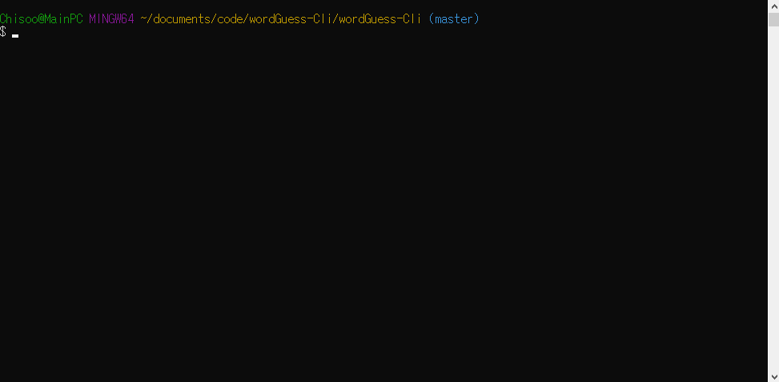
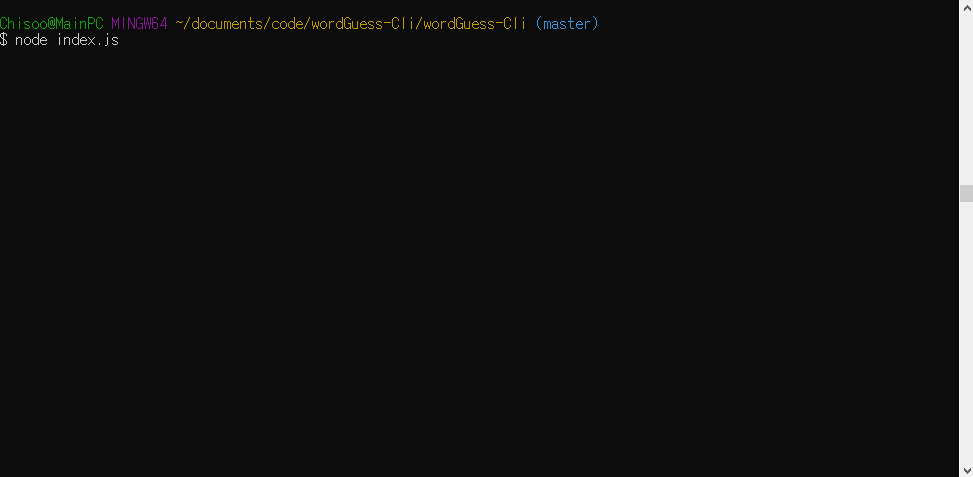
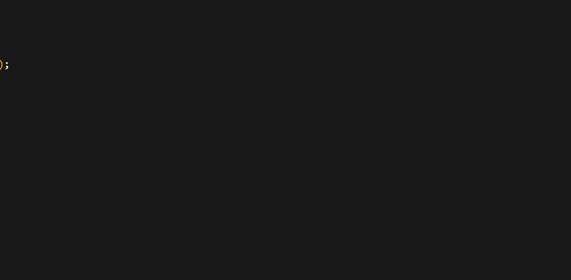

# wordGuess-Cli
- combination of node.js and constructor highlight
- Emphasizes on keeping codes shallow

## Overview

hangman style command-line game using constructor functions.

## Features

- [x] Fully functioning hangman game. 
- [x] Registers both uppercase and lowercase as same input.
- [x] colorful command lines!.
- [] filters and reject repeated words/multiple letter input.

## Node packages used:

* [mysql](https://www.npmjs.com/package/mysql)
* [inquirer](https://www.npmjs.com/package/inquirer)
* [colors](https://www.npmjs.com/package/colors)

## Instruction:

1. before typing `node index.js` into command-line, you must download node packages in order for the app to work. To download the packages, type `npm install` into command-line.
2. After package installation, type `node index.js`
3. Enjoy the app!

## Demo:
### Win condition:

### Unwanted input and loss:

### Application continuity:
